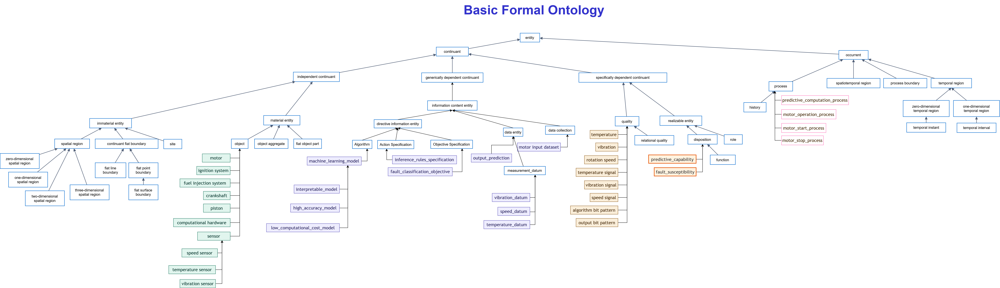
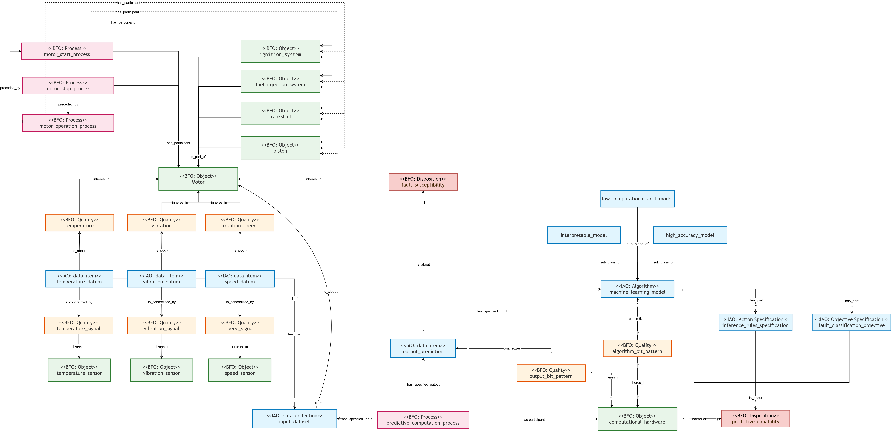

# Ontologia de Monitoramento de Motores de Carros a Combustão

**Universidade Federal do Rio Grande do Sul**  
**Instituto de Informática**  
**CMP-196 – Engenharia de Ontologias**

**Autores:**  
- Lucas Schafer Vrielink — lsvrielink@inf.ufrgs.br  
- Roger Centeno Pires — rcpires@inf.ufrgs.br  

**Arquivo OWL:**  
[https://github.com/BDI-UFRGS/CMP196/blob/main/lucas_roger/mml.owl](https://github.com/BDI-UFRGS/CMP196/blob/main/lucas_roger/mml.owl)

---

## 1. Domínio

O domínio modelado é o monitoramento preditivo de motores de combustão, integrando sensores, qualidades observáveis do motor e técnicas de aprendizado de máquina. A ontologia estrutura o motor como entidade material central, compreendendo seus componentes, suas qualidades observáveis e sua suscetibilidade a falhas.

Entre os componentes materiais do motor, foram considerados o pistão, o virabrequim, o sistema de ignição e o sistema de injeção de combustível. Também foram modeladas qualidades operacionais observáveis, como temperatura, vibração e velocidade de rotação.

As qualidades do motor são representadas como continuantes dependentes, pois inerem no motor e não existem isoladamente. Os dados de medição são tratados como entidades informacionais sobre essas qualidades, distinguindo a qualidade física observada do dado produzido sobre ela.

Foram modelados três processos físicos principais: `motor start process`, `motor operation process` e `motor stop process`. Também foi modelado o `predictive computation process`, que utiliza um conjunto de dados de entrada sobre as qualidades do motor e um modelo de Machine Learning para produzir uma predição sobre a suscetibilidade à falha.

---

## 2. Questões de Competência

1. Quais partes compõem o motor?
2. Quais sensores estão associados ao monitoramento do motor?
3. Quais modelos são classificados como modelos interpretáveis?
4. Quais modelos são classificados como modelos de alta acurácia?
5. Quais componentes materiais participam do processo de partida do motor?
6. Quais componentes materiais participam do processo de parada do motor?
7. Qual hardware computacional participa do processo computacional preditivo?
8. Quais dados de medição fazem parte do conjunto de entradas utilizado pelo processo computacional preditivo?
9. Qual processo computacional utiliza o conjunto de entrada?
10. Qual predição é produzida pelo processo computacional preditivo?
11. Qual processo precede o processo de operação do motor?
12. Qual processo sucede o processo de operação do motor?
13. Quais qualidades inerem no motor?
14. Quais dados de medição são sobre cada qualidade do motor?
15. Sobre qual disposição do motor a predição de saída se refere?
16. Qual padrão computacional concretiza o modelo de Machine Learning?
17. Qual padrão computacional concretiza a predição de saída?
18. Qual disposição do hardware computacional é realizada pelo processo computacional preditivo?
19. Qual modelo de Machine Learning é utilizado pelo processo computacional preditivo?
20. Quais modelos são classificados como modelos de baixo custo computacional?

---

## 3. Entidades Modeladas

### 3.1 Continuantes Independentes

- Motor
- Piston
- Crankshaft
- Fuel Injection System
- Ignition System
- Sensor
- Speed Sensor
- Temperature Sensor
- Vibration Sensor
- Computational Hardware

### 3.2 Continuantes Dependentes

- Rotation Speed
- Temperature
- Vibration
- Speed Signal
- Temperature Signal
- Vibration Signal
- Algorithm Bit Pattern
- Output Bit Pattern

### 3.3 Disposições

- Fault Susceptibility
- Predictive Capability

### 3.4 Entidades Informacionais

- Speed Datum
- Temperature Datum
- Vibration Datum
- Motor Input Dataset
- Output Prediction
- Machine Learning Model
- High Accuracy Model
- Low Computational Cost Model
- Interpretable Model
- Fault Classification Objective
- Inference Rules Specification

### 3.5 Ocorrentes / Processos

- Motor Start Process
- Motor Operation Process
- Motor Stop Process
- Predictive Computation Process

### 3.6 Relações

- has fuel injection system
- has ignition system
- has part
- has participant
- bearer of
- inheres in
- is about
- is concretized by
- has specified input
- has specified output
- preceded by
- concretizes

---

## 4. Representações da Ontologia

### 4.1 Árvore da Taxonomia na BFO

### 4.2 Modelagem Proposta

---

## 5. Validação com HermiT

No uso do raciocinador HermiT, surgiram inconsistências referentes à transitividade da relação `has part`. A necessidade de modelar restrições de cardinalidade específica, como `has part exactly 1`, conflita com a natureza transitiva da propriedade na lógica.

Para contornar essa limitação técnica, foram estabelecidas as sub-relações `has fuel injection system` e `has ignition system`, permitindo a correta inferência do modelo sem violações das regras do raciocinador.

Após essas correções, o raciocinador rodou sem erros.

---

## 6. Arquivos da Entrega

- [Ontologia OWL](mml.owl)
- [Documento final](Trabalho%20Final%20-%20CMP196.docx)
- [Apresentação final](TrabalhoFinal%20-%20CMP196.pptx)
- [Árvore BFO](CMP196_BFO_arvore.png)
- [Modelagem proposta](CMP196_modelagem.png)

---

## 7. Ontologias Utilizadas

| Ontologia | Uso no trabalho | URL |
|---|---|---|
| BFO 2020 | Ontologia de topo utilizada para organizar continuantes, ocorrentes, qualidades, disposições, objetos e processos. | [http://purl.obolibrary.org/obo/bfo/2020/bfo.owl](http://purl.obolibrary.org/obo/bfo/2020/bfo.owl) |
| IAO | Ontologia utilizada para representar entidades informacionais, como dados de medição, dataset, predição, especificações e modelo de Machine Learning. | [http://purl.obolibrary.org/obo/iao/2026-03-30/iao.owl](http://purl.obolibrary.org/obo/iao/2026-03-30/iao.owl) |
| RO Core | Ontologia utilizada para relações alinhadas à BFO, como relações de participação, inerência, portador e concretização. | [http://purl.obolibrary.org/obo/ro/releases/2025-12-17/core.owl](http://purl.obolibrary.org/obo/ro/releases/2025-12-17/core.owl) |

